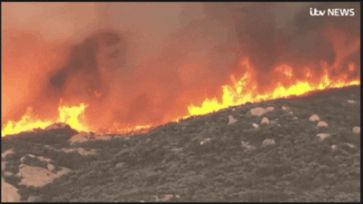

Perfect 👍 Here’s your **complete, polished README** with the new **Tech Stack section (with badges)** included.

---

```markdown
# Real-Time Fire Detector 🔥


A real-time fire detection system using **Convolutional Neural Networks (CNNs)**.  
The system detects fire instantly from live camera feeds (default: laptop webcam), triggers audible alerts, and logs fire events automatically.

---

## 🚀 Key Features

- **Real-Time Detection**: Detects fire instantly from webcam or IP camera feeds.  
- **Cross-Platform Support**: Works with laptop webcams (default) and optional Android phone cameras.  
- **Event Logging**: Automatically logs fire detection events in `fire_alerts.log`.  
- **Audio Alerts**: Plays a simple **beep alarm** when fire is detected.  
- **Lightweight Model**: Trained CNN model optimized for fast inference.

---

## 🖥️ Tech Stack

-  — Core programming language  
-  — CNN model training & inference  
-  — High-level model building  
-  — Video capture & image preprocessing  
-  — Numerical operations  
-  — Plotting training results  
-  — Evaluation metrics  

---

## 📁 Project Structure

```

RealTime-Fire-Detector/
│
├── dataset_sample/           # Small sample images (fire / non-fire)
├── models/
│   └── forest_fire_cnn.h5    # Trained CNN model (from models.rar)
├── notebooks/
│   └── train_fire_model.ipynb
├── fire_detection.py          # Real-time detection code
├── requirements.txt           # Python dependencies
├── README.md
└── LICENSE

````

---

## 🎥 Demo

 

---

## 🛠️ Installation & Requirements

**Python 3.10+** is required along with the following packages:

```text
tensorflow>=2.12.0
keras>=2.12.0
opencv-python
numpy
matplotlib
scikit-learn
jupyter
ipykernel
````

### Install dependencies via pip:

```bash
pip install -r requirements.txt
```

### Or with Conda:

```bash
conda create -n ds_env python=3.10
conda activate ds_env
pip install -r requirements.txt
```

---

## 🚦 How to Use

### 1️⃣ Laptop Webcam (Default)

Simply run:

```bash
python fire_detection.py
```

> The system will automatically use your laptop’s built-in webcam (device index `0`).
> Fire detection results will appear on screen, and a **beep alert** will sound if fire is detected.
> Press **`q`** to quit the program.

---

### 2️⃣ Android Phone Camera (Optional, via IP Webcam)

1. Install the **IP Webcam** app on your phone.
2. Connect your PC and phone to the **same Wi-Fi network**.
3. Start IP Webcam → choose **MJPEG / Browser stream**.
4. Update the URL in `fire_detection.py`:

```python
url = "http://<your-phone-ip>:8080/video"
```

5. Run the detection script:

```bash
python fire_detection.py
```

---

## 📥 Download the Trained Model

The trained CNN model for real-time fire detection can be downloaded here:

[Download models.rar](https://github.com/malik8154/RealTime-Fire-Detector/releases/download/v1.0/models.rar)

> Extract the `.rar` file to get `forest_fire_cnn.h5` before running `fire_detection.py`.

---

## ⚠️ Notes & Tips

* Any small flame (candle, lighter, or fire video) can be used for testing.
* No need to demonstrate an actual forest fire.
* Ensure **good lighting** and **camera clarity** for accurate detection.
* Recommended for **educational, safety simulation, or prototyping purposes**.

---

## 🤝 Contributing

Contributions are welcome! If you have improvements, optimizations, or bug fixes, feel free to submit a **pull request** or open an **issue**.

---

## 📌 License

This project is licensed under the **MIT License**. See the [LICENSE](LICENSE) file for details.

---

## 💡 About

This project demonstrates the power of **computer vision and deep learning** for real-world safety applications.
It showcases practical experience with **TensorFlow, Keras, and OpenCV**, as well as deploying models for **real-time live video analysis**.
Do you also want me to make a **short one-line tagline** (like *“AI-powered real-time fire detection system using CNNs and OpenCV”*) for the top under the title? It looks very professional on GitHub.
```
